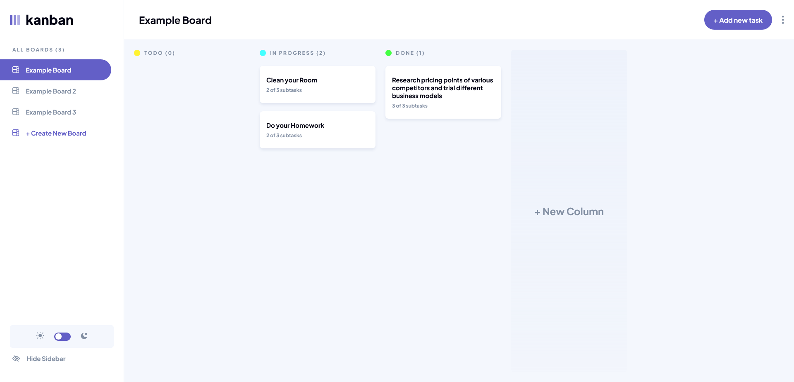
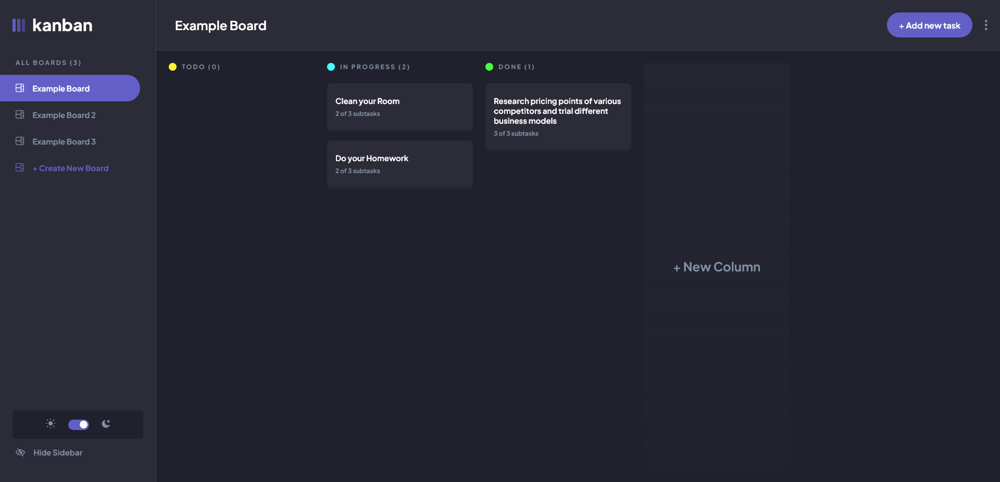
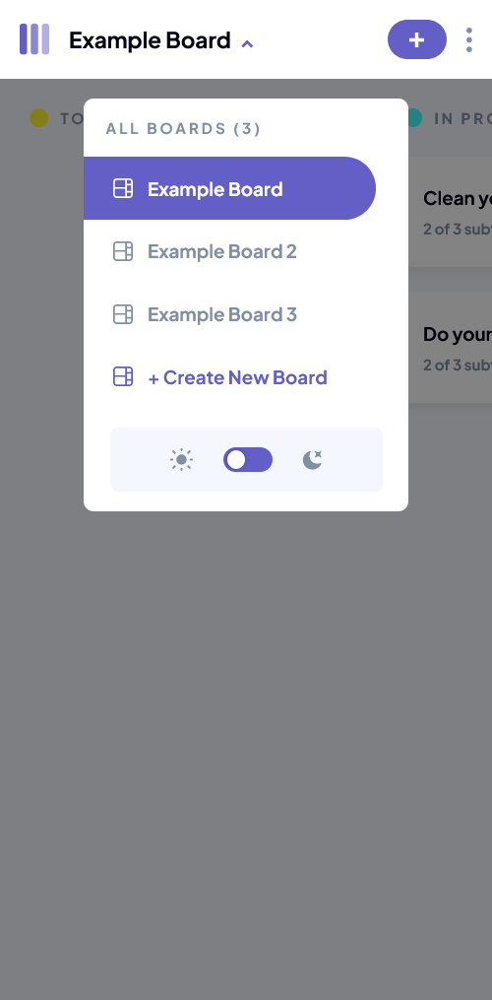
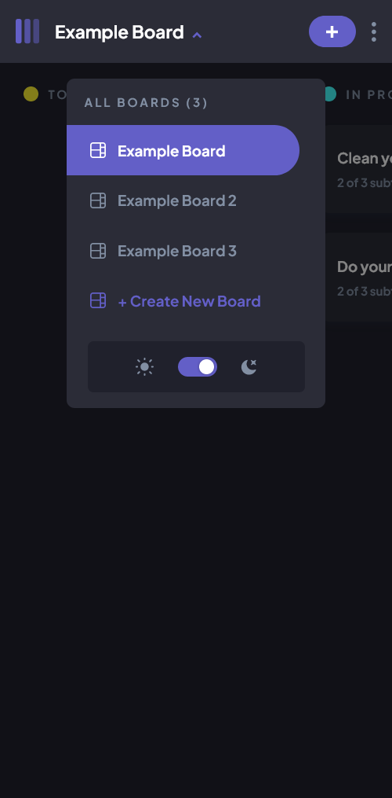

# Frontend Mentor - Kanban task management web app solution

This is a solution to the [Kanban task management web app challenge on Frontend Mentor](https://www.frontendmentor.io/challenges/kanban-task-management-web-app-wgQLt-HlbB). Frontend Mentor challenges help you improve your coding skills by building realistic projects.

## Table of contents

- [Overview](#overview)
  - [The challenge](#the-challenge)
  - [Screenshot](#screenshot)
  - [Links](#links)
- [My process](#my-process)
  - [Built with](#built-with)
  - [What I learned](#what-i-learned)
  - [Continued development](#continued-development)
  - [Useful resources](#useful-resources)
- [Author](#author)

## Overview

### The challenge

Users should be able to:

- View the optimal layout for the app depending on their device's screen size ✔️
- See hover states for all interactive elements on the page ✔️
- Create, read, update, and delete boards and tasks ✔️
- Receive form validations when trying to create/edit boards and tasks ✔️
- Mark subtasks as complete and move tasks between columns ✔️
- Hide/show the board sidebar ✔️
- Toggle the theme between light/dark modes ✔️
- **Bonus**: Allow users to drag and drop tasks to change their status and re-order them in a column ✔️
- **Bonus**: Keep track of any changes, even after refreshing the browser (`localStorage` could be used for this if you're not building out a full-stack app) ✔️

### Screenshot

### Links

- Solution URL: [Github](https://github.com/Clytax/fem-kanban)
- Live Site URL: [Vercel](https://kanban-board-psi.vercel.app)

## My process

### Built with

- Semantic HTML5 markup
- CSS custom properties
- Flexbox
- CSS Grid
- Mobile-first workflow
- React Beautiful DnD - Drag and drop
- [SCSS](https://sass-lang.com/) - For styles
- [React](https://reactjs.org/) - JS library
- [Redux](https://redux.js.org/) - State management
- [Redux Toolkit](https://redux-toolkit.js.org/) - For Redux setup
- [React Router](https://reactrouter.com/) - For routing

### What I learned

I recently started learning Redux so this project was an amazing opportunity to learn more about it. I also learned how to use React Beautiful DnD for drag and drop functionality.

### Continued development

I keep learning new things everyday but I want t ofocus on creating semantic HTML and CSS, not like I did because I made seperate Headers for mobile and desktop. I also want to learn how to create Full Stack Apps.

### Useful resources

- [Codeacademy - Learn Redux](https://www.codecademy.com/learn/learn-redux) - The only source I needed for learning Redux.
- [Kanban Board by Kevin Mason](https://www.frontendmentor.io/solutions/kanban-task-management-board-with-drag-and-drop-made-with-reactredux-m3VxmCG4UL) - His solution really helped me figure out how to implement the drag and drop functionality.

## Author

- Marco Spano - [Clytax](https://www.github.com/Clytax)
